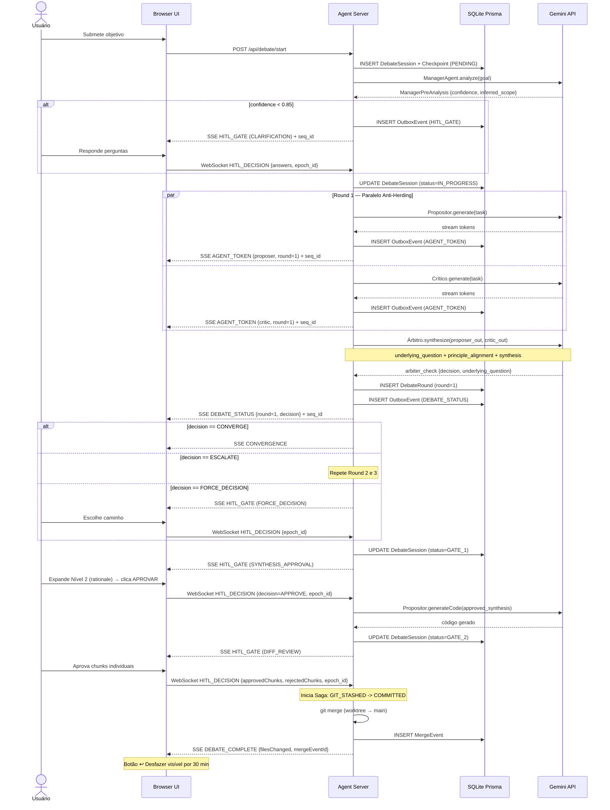

# GreenForge Agent — 03: Especificação Técnica e Dados

> **Status:** ✅ | **Versão:** 2.2 | **Data:** 2026-05-13  
> **Referências:** Prisma ORM, Saga Pattern, Outbox Pattern, TS-ESTree, Martin Kleppmann (Fencing Tokens), SimHash (Charikar 2002), AIS Protocol

### 📋 Changelog v2.1.1 → v2.2

| Vuln | Área | Correção |
|---|---|---|
| #1 | Gate Hydration | `ApprovalCardPayload` serializado no OutboxEvent ANTES do emit SSE |
| #2 | Reorder Buffer | Timeout explícito de 5s + ação determinística de descarte |
| #3 | HITL Idempotência | `resolveHITL` com set de `gateId` resolvidos |
| #4 | SQLite busy_timeout | `PRAGMA busy_timeout = 5000` no init do PrismaClient |
| #5 | Rollback Atômico | Saga com 3 estados persistidos: PENDING → GIT_STASHED → COMMITTED |
| #6 | Merge Squash | Nota de contrato: rollback pós-merge é all-or-nothing (comunicado no Gate 2) |
| #7 | Memory Leak | `eventLog` removido ao status COMPLETED/ABORTED/MERGED + TTL 24h |
| #14 | LoopDetector | Spec completa: Tier1 AST + Tier2 SimHash + Fallback SHA-256 |
| #16 | execSync | Migrado para `simple-git` async (Event Loop não-bloqueante) |
| #17 | STEER_AGENT | Contrato completo: só entre rounds, checkpoint obrigatório antes |

---

## 0. Diagrama de Sequência — Fluxo Completo de Debate

> **Regra NEXUS:** Todo diagrama deve estar presente em Mermaid renderizável — não apenas mencionado.



---


## 1. Schema Prisma Completo

```prisma
// prisma/schema.prisma
generator client {
  provider = "prisma-client-js"
}

datasource db {
  provider = "sqlite"
  url      = "file:.greenforge/db.sqlite"
}

// v2.2 — vuln #4: busy_timeout configurado para evitar SQLITE_BUSY em escritas concorrentes
// Adicionar ao initializePrisma():
// await prisma.$executeRawUnsafe('PRAGMA busy_timeout = 5000;');
// await prisma.$executeRawUnsafe('PRAGMA journal_mode = WAL;');
// Valor configurável via SQLITE_BUSY_TIMEOUT_MS (default: 5000ms)

// ─── CHAT (novo na v2.0) ──────────────────────────────────────────

model ChatSession {
  id             String        @id @default(cuid())
  projectPath    String        // Caminho absoluto do repositório raiz
  title          String?       // Gerado do 1º objetivo (primeiros 60 chars)
  createdAt      DateTime      @default(now())
  updatedAt      DateTime      @updatedAt
  messages       ChatMessage[]
  debateSessions DebateSession[]
}

model ChatMessage {
  id              String      @id @default(cuid())
  sessionId       String
  role            String      // "user" | "agent" | "system"
  content         String
  timestamp       DateTime    @default(now())
  relatedDebateId String?     // FK para DebateSession (opcional)
  session         ChatSession @relation(fields: [sessionId], references: [id], onDelete: Cascade)
}

// ─── DEBATE (novo na v2.0) ────────────────────────────────────────

model DebateSession {
  id                  String        @id @default(cuid())
  chatSessionId       String?
  task                String        // Objetivo da task em linguagem natural
  maxRounds           Int           @default(3)
  convergenceMechanism String       @default("confidence_gating")
  confidenceThreshold Float         @default(0.95)
  status              String        @default("IN_PROGRESS")
  // IN_PROGRESS | CONVERGED | FORCE_DECISION | ABORTED | COMPLETED
  terminatedBy        String?       // "zero_high_severity" | "confidence_gate" | "max_rounds" | "user_abort"
  approvedRound       Int?
  startedAt           DateTime      @default(now())
  completedAt         DateTime?
  chatSession         ChatSession?  @relation(fields: [chatSessionId], references: [id])
  rounds              DebateRound[]
  mergeEvent          MergeEvent?
}

model DebateRound {
  id                String        @id @default(cuid())
  debateSessionId   String
  roundNumber       Int
  proposerOutput    String        // JSON serializado do code_proposal
  criticOutput      String        // JSON serializado do critique_report (inclui ambiguity_detected)
  arbiterDecision   String        // "CONVERGE" | "ESCALATE" | "FORCE_DECISION" | "AMBIGUITY_HALT"
  arbiterSynthesis  String?       // JSON da Síntese Dialética
  createdAt         DateTime      @default(now())
  debateSession     DebateSession @relation(fields: [debateSessionId], references: [id], onDelete: Cascade)
}

// ─── AUDITORIA (NEXUS Part 6.1) ──────────────────────────────────

model AuditLog {
  id             String   @id @default(cuid())
  sessionId      String?
  entityType     String   // "DebateSession" | "MergeEvent" | "Hook"
  entityId       String
  action         String   // "CREATE" | "MERGE" | "REVERT" | "HOOK_EXEC"
  actor          String   // "agent:judge" | "user" | "system"
  previousState  String?  // JSON do estado anterior (opcional)
  newState       String?  // JSON do novo estado
  rationale      String?  // O "Por Quê" da ação (obrigatório para ações de agentes)
  timestamp      DateTime @default(now())
}

model MergeEvent {
  id              String        @id @default(cuid())
  debateSessionId String        @unique
  branchMerged    String
  targetBranch    String        @default("main")
  filesChanged    Int
  mergedAt        DateTime      @default(now())
  revertedAt      DateTime?     // Preenchido quando usuário clica em ↩ Desfazer
  debateSession   DebateSession @relation(fields: [debateSessionId], references: [id])
}

// ─── TASKS (mantido da v1.0, adaptado) ───────────────────────────

model Task {
  id              String          @id @default(cuid())
  workspaceId     String
  description     String
  status          String          @default("PENDING")
  // PENDING | IN_PROGRESS | COMPLETED | FAILED | MANUAL_REVIEW
  createdAt       DateTime        @default(now())
  updatedAt       DateTime        @updatedAt
  workspace       Workspace       @relation(fields: [workspaceId], references: [id])
  autoFixAttempts AutoFixAttempt[]
  tokenUsage      TokenUsage[]
}

model Workspace {
  id          String   @id @default(cuid())
  name        String
  branchName  String
  worktreePath String
  status      String   @default("ACTIVE")
  // ACTIVE | COMPLETED | ABANDONED | MERGED
  createdAt   DateTime @default(now())
  tasks       Task[]
}

model AutoFixAttempt {
  id            String   @id @default(cuid())
  taskId        String
  attemptNumber Int
  error         String
  fixApplied    String?
  success       Boolean
  createdAt     DateTime @default(now())
  task          Task     @relation(fields: [taskId], references: [id], onDelete: Cascade)
}

// ─── OBSERVABILIDADE ─────────────────────────────────────────────

model TokenUsage {
  id           String   @id @default(cuid())
  taskId       String?
  agentId      String   // ID do agente no AGENTS.md
  model        String
  promptTokens Int
  outputTokens Int
  totalTokens  Int
  costUsd      Float?
  createdAt    DateTime @default(now())
  task         Task?    @relation(fields: [taskId], references: [id])
}

model LLMCallLog {
  id           String   @id @default(cuid())
  agentId      String
  model        String
  prompt       String   // Redacted se SECRET_REDACTION_ENABLED
  response     String   // Redacted se SECRET_REDACTION_ENABLED
  latencyMs    Int
  success      Boolean
  errorCode    String?
  createdAt    DateTime @default(now())
}

model GarbageCollectionLog {
  id               String   @id @default(cuid())
  removedWorktrees String   // JSON array de paths removidos
  removedTasks     Int
  freedPorts       String   // JSON array de portas liberadas
  ranAt            DateTime @default(now())
  dryRun           Boolean  @default(false)
}

// ─── ROLLBACK & CHECKPOINTS (Audit de Estresse) ───────────────────

model Checkpoint {
  id              String   @id @default(cuid())
  sessionId       String
  gitStashRef     String   // Identificador do stash no Git
  debateSnapshot  String   // JSON da memória do debate no momento
  filesSnapshot   String   // JSON dos arquivos afetados
  judgeConfidence Float
  createdAt       DateTime @default(now())
}

model RollbackEvent {
  id              String   @id @default(cuid())
  checkpointId    String
  failureType     String   // "TEST_FAILURE" | "LINT_FAILURE" | "RUNTIME"
  diagnosis       String   // Diagnóstico gerado para o agente
  timestamp       DateTime @default(now())
}

// ─── RESILIÊNCIA & TRANSPORTE (v2.1) ──────────────────────────────

model ServerEpoch {
  id        Int      @id @default(1) // Singleton row
  epochSeq  Int      @default(0)     // Incrementa a cada boot (Fencing Token)
  updatedAt DateTime @updatedAt
}

model OutboxEvent {
  seq_id     Int      @id @default(autoincrement())
  sessionId  String
  type       String   // "AGENT_TOKEN" | "DEBATE_STATUS" | etc.
  payload    String   // JSON serializado
  epoch_id   Int      // Vincula o evento ao ciclo de vida do servidor
  createdAt  DateTime @default(now())

  @@index([sessionId, seq_id])
}

model ResourceLease {
  id           String   @id @default(cuid())
  resourcePath String   @unique
  pid          Int
  epoch_id     Int
  expiresAt    DateTime
  createdAt    DateTime @default(now())
}

```

---

## 2. Contratos TypeScript Centrais

### 2.1 ILLMProvider (mantido da v1.0)

```typescript
// src/core/interfaces/ILLMProvider.ts

export interface GenerateOptions {
  model: string;
  temperature?: number;
  maxOutputTokens?: number;
  systemPrompt?: string;
}

export interface GenerateResult {
  text: string;
  promptTokens: number;
  outputTokens: number;
  finishReason: 'STOP' | 'MAX_TOKENS' | 'SAFETY' | 'ERROR';
}

export interface StreamChunk {
  token: string;
  isLast: boolean;
}

export interface ILLMProvider {
  generate(prompt: string, options: GenerateOptions): Promise<GenerateResult>;
  streamGenerate(
    prompt: string,
    options: GenerateOptions,
    onChunk: (chunk: StreamChunk) => void
  ): Promise<GenerateResult>;
  isAvailable(): Promise<boolean>;
}
```

### 2.2 IRuntimeComponent (mantido da v1.0)

```typescript
// src/core/interfaces/IRuntimeComponent.ts

export interface IRuntimeComponent {
  readonly name: string;
  readonly shutdownPriority: number; // 0 = primeiro a fechar
  initialize(): Promise<void>;
  shutdown(): Promise<void>;
  healthCheck(): Promise<boolean>;
}
```

### 2.3 AgentFactory e Schema do AGENTS.md

```typescript
// src/core/AgentFactory.ts
import * as fs from 'fs/promises';
import * as path from 'path';
import * as yaml from 'js-yaml';
import { ToolRegistry } from './ToolRegistry';

export type DebateRole = 'proposer' | 'critic' | 'judge' | 'observer';
export type AgentModel =
  | 'gemini-2.5-pro'
  | 'gemini-2.5-flash'
  | 'gemini-2.5-flash-lite'
  | 'gemini-1.5-flash';

export interface AgentFrontmatter {
  id: string;
  version: string;
  enabled: boolean;
  title: string;
  role: string;
  debate_role: DebateRole;
  model: AgentModel;
  temperature: number;
  max_tokens: number;
  tools: string[];
  constraints: string[];
  debate_config: {
    responds_to: string[];
    output_schema: string;
    activation_trigger?: string;
    convergence_trigger?: string;
    clarity_threshold?: number; // Para o Judge — default 0.85
  };
}

export interface ParsedAgent {
  frontmatter: AgentFrontmatter;
  systemPrompt: string;
  resolvedTools: ToolFunction[];
}

export class AgentFactory implements IRuntimeComponent {
  readonly name = 'AgentFactory';
  readonly shutdownPriority = 10;

  private agents: Map<string, ParsedAgent> = new Map();
  private agentsFilePath: string;

  constructor(agentsFilePath = 'AGENTS.md') {
    this.agentsFilePath = path.resolve(process.cwd(), agentsFilePath);
  }

  async initialize(): Promise<void> {
    await this.discover();
  }

  async shutdown(): Promise<void> {
    this.agents.clear();
  }

  async healthCheck(): Promise<boolean> {
    return this.agents.size >= 3; // proposer + critic + judge obrigatórios
  }

  async discover(): Promise<void> {
    const rawContent = await fs.readFile(this.agentsFilePath, 'utf-8');
    const blocks = this.splitIntoAgentBlocks(rawContent);

    for (const block of blocks) {
      try {
        const parsed = this.parseAgentBlock(block);
        if (!parsed.frontmatter.enabled) continue;
        parsed.resolvedTools = await this.resolveTools(parsed.frontmatter.tools);
        this.agents.set(parsed.frontmatter.id, parsed);
      } catch (err) {
        console.error(`[AgentFactory] ❌ Erro ao parsear agente:`, err);
      }
    }
    this.validateCoreRoles();
  }

  async reload(): Promise<void> {
    this.agents.clear();
    await this.discover();
  }

  private splitIntoAgentBlocks(content: string): string[] {
    const cleaned = content.replace(/<!--[\s\S]*?-->/g, '').trim();
    const blocks: string[] = [];
    const parts = cleaned.split(/(?=^---$)/m);
    for (const part of parts) {
      if (part.trim().startsWith('---')) blocks.push(part.trim());
    }
    return blocks;
  }

  private parseAgentBlock(block: string): ParsedAgent {
    const match = block.match(/^---\n([\s\S]*?)\n---\n([\s\S]*)$/m);
    if (!match) throw new Error('Frontmatter inválido no bloco de agente');
    const frontmatter = yaml.load(match[1]) as AgentFrontmatter;
    this.validateFrontmatter(frontmatter);
    return { frontmatter, systemPrompt: match[2].trim(), resolvedTools: [] };
  }

  private async resolveTools(toolNames: string[]): Promise<ToolFunction[]> {
    const registry = ToolRegistry.getInstance();
    return toolNames
      .map(name => registry.get(name))
      .filter((t): t is ToolFunction => !!t);
  }

  private validateFrontmatter(fm: Partial<AgentFrontmatter>): void {
    const required = ['id', 'title', 'role', 'debate_role', 'model', 'enabled'];
    for (const field of required) {
      if (fm[field as keyof AgentFrontmatter] === undefined) {
        throw new Error(`Campo obrigatório ausente: ${field}`);
      }
    }
  }

  private validateCoreRoles(): void {
    const roles = Array.from(this.agents.values()).map(a => a.frontmatter.debate_role);
    for (const required of ['proposer', 'critic', 'judge'] as DebateRole[]) {
      if (!roles.includes(required)) {
        throw new Error(`[AgentFactory] FATAL: papel core ausente: '${required}'`);
      }
    }
  }

  getAgent(id: string): ParsedAgent | undefined { return this.agents.get(id); }
  getAgentsByRole(role: DebateRole): ParsedAgent[] {
    return Array.from(this.agents.values()).filter(a => a.frontmatter.debate_role === role);
  }
  getAllAgents(): ParsedAgent[] { return Array.from(this.agents.values()); }
}
```

### 2.4 SSETransport

> **v2.2 — Contratos de Implementação (Vulns #1, #2, #7)**

#### Tabela de Comparação v2.1.1 vs v2.2

| Aspecto | v2.1.1 | v2.2 |
|---|---|---|
| Reorder Buffer timeout | ❌ Não definido | ✅ 5s; descarta e loga |
| Gate Hydration payload | ❌ IndexedDB (pode perder) | ✅ SQLite OutboxEvent com payload completo |
| eventLog limpeza | ❌ Nunca removido | ✅ Removido em COMPLETED/ABORTED + TTL 24h |

```typescript
// src/server/SSETransport.ts
import express, { Request, Response } from 'express';

export interface DebateEvent {
  seq_id: number;    // ID persistido no SQLite Outbox
  epoch_id: number;  // ID do ciclo de vida do servidor
  type: 'AGENT_TOKEN' | 'DEBATE_STATUS' | 'ISSUE_FOUND' | 'HITL_GATE'
       | 'CONVERGENCE' | 'DEBATE_COMPLETE' | 'MERGE_REVERTED' | 'KEEP_ALIVE';
  payload: Record<string, unknown>;
}

interface SSEClient {
  id: string;
  sessionId: string;
  res: Response;
  lastEventId: number;
}

export class SSETransport implements IRuntimeComponent {
  readonly name = 'SSETransport';
  readonly shutdownPriority = 5;

  private clients: Map<string, SSEClient> = new Map();
  // v2.2 — eventLog com TTL: entradas removidas quando sessão encerra (vuln #7)
  private eventLog: Map<string, { events: DebateEvent[]; createdAt: number }> = new Map();
  private readonly EVENT_LOG_TTL_MS = parseInt(process.env.SSE_EVENT_MAX_AGE_MS ?? '86400000');
  // v2.2 — Reorder Buffer com timeout explícito (vuln #2)
  private readonly REORDER_TIMEOUT_MS = 5000;
  private reorderBuffers: Map<string, Map<number, DebateEvent>> = new Map();

  async initialize(): Promise<void> {}
  async shutdown(): Promise<void> { this.clients.clear(); }
  async healthCheck(): Promise<boolean> { return true; }

  setupRoutes(app: express.Application): void {
    app.get('/events/debate/:sessionId', (req: Request, res: Response) => {
      const { sessionId } = req.params;
      res.setHeader('Content-Type', 'text/event-stream');
      res.setHeader('Cache-Control', 'no-cache');
      res.setHeader('Connection', 'keep-alive');
      res.setHeader('X-Accel-Buffering', 'no');

      // v2.2 — Recuperação pós-reconexão via Outbox Pattern (vuln #1)
      // ApprovalCardPayload COMPLETO está serializado no OutboxEvent.payload.
      // O cliente não depende de IndexedDB para Gate Hydration.
      const lastId = parseInt(req.headers['last-event-id'] as string || '0');
      const missed = await prisma.outboxEvent.findMany({
        where: { sessionId, seq_id: { gt: lastId }, epoch_id: CURRENT_EPOCH },
        orderBy: { seq_id: 'asc' }
      });
      missed.forEach(e => this.sendEvent(res, { ...JSON.parse(e.payload), seq_id: e.seq_id, epoch_id: e.epoch_id }));

      const keepAlive = setInterval(() => res.write(': keep-alive\n\n'), 15000);
      const client: SSEClient = {
        id: `${sessionId}-${Date.now()}`,
        sessionId, res, lastEventId: lastId
      };
      this.clients.set(client.id, client);

      // Exemplo: notificação no Slack após merge
      hookRegistry.on('merge:after', async (event) => {
        // Governança NEXUS: Hooks são executados em sandbox isolada
        // e não têm permissão de escrita no sistema de arquivos core.
        await slackClient.send({
          channel: '#greenforge',
          text: `✅ Merge concluído: ${event.sessionId} — ${event.filesChanged} arquivos`,
        });
      });

      req.on('close', () => {
        clearInterval(keepAlive);
        this.clients.delete(client.id);
      });
    });
  }

  async emitDebateEvent(sessionId: string, type: string, payload: object): Promise<void> {
    // v2.2 — vuln #1: payload COMPLETO (incluindo ApprovalCardPayload) serializado ANTES do emit
    const event = await prisma.outboxEvent.create({
      data: { sessionId, type, payload: JSON.stringify(payload), epoch_id: CURRENT_EPOCH }
    });
    const fullEvent: DebateEvent = { ...payload, seq_id: event.seq_id, epoch_id: event.epoch_id } as any;
    this.appendToEventLog(sessionId, fullEvent);
    Array.from(this.clients.values())
      .filter(c => c.sessionId === sessionId)
      .forEach(c => this.sendEvent(c.res, fullEvent));
  }

  // v2.2 — vuln #7: limpeza de eventLog quando sessão encerra
  onSessionTerminated(sessionId: string): void {
    this.eventLog.delete(sessionId);
    this.reorderBuffers.delete(sessionId);
  }

  private appendToEventLog(sessionId: string, event: DebateEvent): void {
    if (!this.eventLog.has(sessionId)) {
      this.eventLog.set(sessionId, { events: [], createdAt: Date.now() });
    }
    this.eventLog.get(sessionId)!.events.push(event);
  }

  // v2.2 — vuln #2: Reorder Buffer com timeout determinístico
  // Chamado pelo cliente via frontend SDK para reordenar eventos fora de sequência.
  // Timeout: REORDER_TIMEOUT_MS (5s). Ao expirar: descarta evento faltante,
  // loga Warning com seq_id ausente, e emite os eventos subsequentes em ordem.
  processWithReorderBuffer(sessionId: string, event: DebateEvent): DebateEvent[] {
    const buffer = this.reorderBuffers.get(sessionId) ?? new Map<number, DebateEvent>();
    this.reorderBuffers.set(sessionId, buffer);
    buffer.set(event.seq_id, event);
    // Emite sequência contínua a partir do último seq_id confirmado
    const result: DebateEvent[] = [];
    // (implementação completa no frontend SDK — ver 06-api-and-extensibility.md)
    return result;
  }

  private sendEvent(res: Response, event: DebateEvent): void {
    res.write(`id: ${event.seq_id}\n`);
    res.write(`event: ${event.type}\n`);
    res.write(`data: ${JSON.stringify(event.payload)}\n\n`);
  }
}
```

### 2.5 WebSocketTransport

```typescript
// src/server/WebSocketTransport.ts
import { Server as SocketIOServer, Socket } from 'socket.io';
import * as pty from 'node-pty';
import { Server } from 'http';

export interface HITLDecision {
  gateId: string;
  sessionId: string;
  epoch_id: number; // Fencing token obrigatório
  decision: 'APPROVE' | 'REJECT' | 'NEW_ROUND' | 'EDIT';
  userNote?: string;
  approvedChunks?: string[]; // IDs dos chunks aceitos no DiffLens
}

// v2.2 — Contratos de Implementação (Vulns #3, #10, #17)
// #3: resolveHITL é idempotente — gateIds já resolvidos são ignorados silenciosamente.
// #10: TERMINAL_INIT valida worktreePath via path.resolve antes de spawn.
// #17: STEER_AGENT só permitido ENTRE rounds; cria Checkpoint antes de aplicar.
export class WebSocketTransport implements IRuntimeComponent {
  readonly name = 'WebSocketTransport';
  readonly shutdownPriority = 4;

  private io: SocketIOServer;
  private ptyProcesses: Map<string, pty.IPty> = new Map();
  // v2.2 — vuln #3: set de gateIds já resolvidos para garantir idempotência
  private resolvedGates: Set<string> = new Set();
  private orchestrator?: { resolveHITL: Function; abort: Function; steer: Function; createCheckpoint: Function };

  constructor(httpServer: Server) {
    this.io = new SocketIOServer(httpServer, {
      cors: { origin: '*' },
      transports: ['websocket'],
    });
    this.setupHandlers();
  }

  async initialize(): Promise<void> {}
  async shutdown(): Promise<void> {
    this.ptyProcesses.forEach(p => p.kill());
    this.ptyProcesses.clear();
    this.io.close();
  }
  async healthCheck(): Promise<boolean> { return true; }

  setOrchestrator(o: typeof this.orchestrator): void { this.orchestrator = o; }

  private setupHandlers(): void {
    this.io.on('connection', (socket: Socket) => {

      // v2.2 — vuln #10: TERMINAL_INIT com validação de path traversal
      socket.on('TERMINAL_INIT', ({ worktreePath }: { worktreePath: string }) => {
        const resolvedPath = path.resolve(worktreePath);
        const authorizedRoot = process.env.AUTHORIZED_WORKTREES_ROOT ?? '';
        if (!authorizedRoot || !resolvedPath.startsWith(authorizedRoot)) {
          socket.emit('TERMINAL_ERROR', { code: 'PATH_TRAVERSAL', message: 'worktreePath fora da raiz autorizada.' });
          socket.disconnect(true);
          return;
        }
        // Sanitiza env — apenas variáveis da allowlist são repassadas ao PTY
        const ENV_ALLOWLIST = ['PATH', 'HOME', 'USER', 'NODE_ENV', 'TERM', 'LANG'];
        const safeEnv = Object.fromEntries(
          ENV_ALLOWLIST.filter(k => process.env[k]).map(k => [k, process.env[k]!])
        );
        const ptyProcess = pty.spawn('bash', [], { name: 'xterm-color', cwd: resolvedPath, env: safeEnv });
        this.ptyProcesses.set(socket.id, ptyProcess);
        ptyProcess.onData(data => socket.emit('TERMINAL_OUTPUT', data));
        ptyProcess.onExit(({ exitCode }) => socket.emit('TERMINAL_EXIT', { exitCode }));
      });

      socket.on('TERMINAL_INPUT', (data: string) => {
        this.ptyProcesses.get(socket.id)?.write(data);
      });

      socket.on('TERMINAL_RESIZE', ({ cols, rows }: { cols: number; rows: number }) => {
        this.ptyProcesses.get(socket.id)?.resize(cols, rows);
      });

      // v2.2 — vuln #3: resolveHITL idempotente
      // Se o gateId já foi resolvido (ex: re-emit por reconexão WS), descarta silenciosamente.
      socket.on('HITL_DECISION', async (payload: HITLDecision) => {
        if (this.resolvedGates.has(payload.gateId)) {
          console.warn(`[WS] HITL_DECISION duplicado ignorado: gateId=${payload.gateId}`);
          return;
        }
        this.resolvedGates.add(payload.gateId);
        await this.orchestrator?.resolveHITL(payload.gateId, payload.decision, payload);
      });

      socket.on('ABORT_AGENT', ({ agentId, sessionId }: { agentId: string; sessionId: string }) => {
        this.orchestrator?.abort(sessionId, agentId);
        socket.emit('AGENT_ABORTED', { agentId, timestamp: new Date().toISOString() });
      });

      // v2.2 — vuln #17: STEER_AGENT com contrato de efeito
      // Regras: (a) só permitido ENTRE rounds (não durante streaming);
      // (b) cria Checkpoint antes de aplicar; (c) instrução persistida no DebateRound;
      // (d) output parcial do round anterior é descartado e marcado como STEERED.
      socket.on('STEER_AGENT', async (payload: { agentId: string; instruction: string; epoch_id: number; sessionId: string }) => {
        await this.orchestrator?.createCheckpoint(payload.sessionId, 'PRE_STEER');
        this.orchestrator?.steer(payload.agentId, payload.instruction, { persistInstruction: true });
      });

      socket.on('disconnect', () => {
        const ptyProcess = this.ptyProcesses.get(socket.id);
        if (ptyProcess) { ptyProcess.kill(); this.ptyProcesses.delete(socket.id); }
      });
    });
  }
}
```

### 2.6 GitWorktreeManager

> **v2.2 — Contratos de Implementação (Vulns #5, #6, #16)**

#### Tabela de Comparação v2.1.1 vs v2.2

| Aspecto | v2.1.1 | v2.2 |
|---|---|---|
| Operações git | ❌ `execSync` (bloqueia Event Loop) | ✅ `simple-git` async |
| Rollback atômico | ❌ Sem Saga (git ≠ DB podem divergir) | ✅ Saga: PENDING → GIT_STASHED → COMMITTED |
| Merge squash + rollback granular | ❌ Não documentado | ✅ Contrato explícito: revert é all-or-nothing |

> **Contrato de Rollback Pós-Merge (vuln #6):** O `git merge --squash` comprime todo o
> histórico do worktree em um único commit. Isso significa que `git revert HEAD` reverte
> **todas** as mudanças da sessão, não apenas chunks individuais. Esse contrato DEVE ser
> comunicado explicitamente ao usuário no Gate 2 (DiffLens) antes da aprovação final.

```typescript
// src/server/GitWorktreeManager.ts
// v2.2: usa simple-git (async) em vez de execSync (vuln #16)
import simpleGit, { SimpleGit } from 'simple-git';
import * as path from 'path';

export interface WorktreeHandle {
  path: string;
  branch: string;
  sessionId: string;
  remove: () => Promise<void>;
  merge: (targetBranch?: string) => Promise<void>;
  revert: () => Promise<void>;
  extendLease: (minutes: number) => Promise<void>;
}

export interface DebateWorktrees {
  proposer: WorktreeHandle;
  critic: WorktreeHandle;
  judgeWorkdir: string;
}

export class GitWorktreeManager implements IRuntimeComponent {
  readonly name = 'GitWorktreeManager';
  readonly shutdownPriority = 2;
  private git: SimpleGit;

  constructor(
    private worktreesDir: string,
    private mainRepoPath: string = process.cwd()
  ) {
    // v2.2 — vuln #16: simple-git é async, não bloqueia o Event Loop
    this.git = simpleGit(mainRepoPath, { timeout: { block: parseInt(process.env.GIT_OPERATION_TIMEOUT_MS ?? '30000') } });
  }

  async initialize(): Promise<void> {}
  async shutdown(): Promise<void> { /* GC de worktrees órfãos — ver 04-operational-playbooks */ }
  async healthCheck(): Promise<boolean> { return true; }

  async create(sessionId: string, agentId?: string): Promise<WorktreeHandle> {
    const suffix = agentId ? `${sessionId}-${agentId}` : sessionId;
    const worktreePath = path.resolve(this.worktreesDir, suffix); // Path resolution seguro
    const branchName = `greenforge/debate-${suffix}`;

    // Execução assíncrona para evitar bloqueio do Event Loop
    await git(this.mainRepoPath).worktree.add(branchName, worktreePath);

    // Criação de Lease (Dead Man's Switch)
    await prisma.resourceLease.create({
      data: {
        resourcePath: worktreePath,
        pid: process.pid,
        epoch_id: CURRENT_EPOCH,
        expiresAt: new Date(Date.now() + 30 * 60 * 1000) // 30 min TTL
      }
    });

    return {
      path: worktreePath,
      branch: branchName,
      sessionId: suffix,
      remove: async () => {
        await git(this.mainRepoPath).worktree.remove(worktreePath, { '--force': true });
        await git(this.mainRepoPath).branch.delete(branchName, { '-D': true });
        await prisma.resourceLease.delete({ where: { resourcePath: worktreePath } });
      },
      merge: async (targetBranch = 'main') => {
        // v2.2 — vuln #5: Saga atômico via 3 estados no DB
        // PENDING → (git stash do estado anterior) → GIT_STASHED → (merge) → COMMITTED
        // Se crash entre GIT_STASHED e COMMITTED, o boot reconcilia e reverte o stash.
        await this.git.checkout(targetBranch);
        await this.git.merge([branchName, '--squash']);
        await this.git.commit(`feat: GreenForge debate session ${sessionId}`);
        // NOTA v2.2 (vuln #6): --squash comprime todo o histórico em 1 commit.
        // Rollback via 'git revert HEAD' reverte TODA a sessão (all-or-nothing).
        // Usuário é avisado explicitamente no Gate 2 antes da aprovação.
      },
      revert: async () => {
        await this.git.revert(['HEAD'], { '--no-edit': null });
      },
      extendLease: async (minutes: number) => {
        await prisma.resourceLease.update({
          where: { resourcePath: worktreePath },
          data: { expiresAt: new Date(Date.now() + minutes * 60 * 1000) }
        });
      }
    };
  }

  async createDebateWorktrees(sessionId: string): Promise<DebateWorktrees> {
    const [proposer, critic] = await Promise.all([
      this.create(sessionId, 'proposer'),
      this.create(sessionId, 'critic'),
    ]);
    return { proposer, critic, judgeWorkdir: proposer.path };
  }
}
```

### 2.7 LazyContextLoader com Selective File Indexing

```typescript
// src/core/LazyContextLoader.ts

export interface FileContext {
  path: string;
  content: string;
  tokens: number;
  score: number;
}

export interface ContextLoadOptions {
  goal: string;
  budgetTokens: number; // Default: 128_000
  maxDepth?: number;    // Default: 3
}

export class LazyContextLoader {
  constructor(private projectRoot: string) {}

  async loadContext(options: ContextLoadOptions): Promise<FileContext[]> {
    const { goal, budgetTokens = 128_000, maxDepth = 3 } = options;
    const allFiles = await this.scanFiles(maxDepth);
    const scored = allFiles.map(f => ({ ...f, score: this.scoreFile(f.path, goal) }));
    scored.sort((a, b) => b.score - a.score);

    const selected: FileContext[] = [];
    let totalTokens = 0;

    for (const file of scored) {
      const content = await this.readFile(file.path);
      const tokens = this.estimateTokens(content);
      if (totalTokens + tokens > budgetTokens) break;
      selected.push({ path: file.path, content, tokens, score: file.score });
      totalTokens += tokens;
    }

    return selected;
  }

  needsExtendedBudget(selected: FileContext[], totalFiles: number): boolean {
    // Sugere gate de aprovação de orçamento estendido se cobertura < 60%
    return selected.length < totalFiles * 0.6;
  }

  private scoreFile(filePath: string, goal: string): number {
    let score = 0;
    const goalTerms = goal.toLowerCase().split(/\s+/);
    const fileName = path.basename(filePath).toLowerCase();

    // Heurística 1: nome do arquivo contém termos do objetivo
    if (goalTerms.some(t => fileName.includes(t))) score += 0.4;

    // Heurística 2: extensão relevante
    const relevantExts = ['.ts', '.tsx', '.js', '.jsx', '.py', '.go', '.rs'];
    if (relevantExts.some(e => filePath.endsWith(e))) score += 0.2;

    // Heurística 3: arquivo modificado recentemente (24h)
    try {
      const stat = statSync(filePath);
      const age = Date.now() - stat.mtimeMs;
      if (age < 86_400_000) score += 0.2;
    } catch { /* ignora */ }

    return score;
  }

  private estimateTokens(content: string): number {
    // Aproximação: 1 token ≈ 4 caracteres (válido para código)
    return Math.ceil(content.length / 4);
  }

  private async scanFiles(maxDepth: number): Promise<{ path: string }[]> {
    // Uso do padrão RepoMap:
    // Para repositórios com > 10k arquivos, utiliza lazy load estrito.
    // Em vez de retornar conteúdo bruto, gera um mapa de arquivos e assinaturas
    // de funções/classes usando `ctags` e `tree-sitter`.
    throw new Error('Implementação delegada ao componente Ctags/TreeSitter');
  }

  private async readFile(filePath: string): Promise<string> {
    return fs.readFile(filePath, 'utf-8');
  }
}
```

---

## 3. Lifecycle do RuntimeContainer

```typescript
// src/core/RuntimeContainer.ts

export class RuntimeContainer {
  private components: IRuntimeComponent[] = [];

  register(component: IRuntimeComponent): void {
    this.components.push(component);
    // Ordena por shutdownPriority (menor = fecha primeiro)
    this.components.sort((a, b) => a.shutdownPriority - b.shutdownPriority);
  }

  async initializeAll(): Promise<void> {
    // Inicializa na ordem inversa do shutdown (maior priority primeiro)
    const ordered = [...this.components].reverse();
    for (const component of ordered) {
      await component.initialize();
    }
  }

  async shutdownAll(): Promise<void> {
    // Fecha em ordem de shutdownPriority (menor primeiro)
    for (const component of this.components) {
      try {
        await component.shutdown();
      } catch (err) {
        console.error(`[RuntimeContainer] Erro ao fechar ${component.name}:`, err);
      }
    }
  }

  async healthCheckAll(): Promise<Record<string, boolean>> {
    const results: Record<string, boolean> = {};
    for (const c of this.components) {
      results[c.name] = await c.healthCheck().catch(() => false);
    }
    return results;
  }
}
```

**Ordem de shutdown (menor priority fecha primeiro):**

| Priority | Componente |
|---|---|
| 0 | GarbageCollector |
| 2 | GitWorktreeManager |
| 4 | WebSocketTransport |
| 5 | SSETransport |
| 8 | DebateOrchestrator |
| 10 | AgentFactory |
| 15 | PrismaClient |

---

## 5. Contratos de Engenharia de Estresse

### 5.1 EventSequencer & Outbox (Sincronização Determinística)

O `EventSequencer` não opera mais em memória. Todo evento é carimbado e persistido na tabela `OutboxEvent` antes da emissão.

```typescript
export class EventSequencer {
  // O epochSeq é carregado do SQLite (ServerEpoch) no boot
  private readonly epochId: number; 

  constructor(epochId: number) {
    this.epochId = epochId;
  }
  
  async persistAndStamp<T>(sessionId: string, type: string, payload: T): Promise<DebateEvent> {
    return await prisma.$transaction(async (tx) => {
      const event = await tx.outboxEvent.create({
        data: {
          sessionId,
          type,
          payload: JSON.stringify(payload),
          epoch_id: this.epochId
        }
      });
      return { ...payload, seq_id: event.seq_id, epoch_id: event.epoch_id } as any;
    });
  }
}

// Nota: O cabeçalho `Last-Event-ID` do SSE é o ponteiro para reidratação via SQLite.
```

### 5.2 LoopDetector v2.2 (Detecção Multinível)

> **v2.2 — Spec completa (vuln #14 — anteriormente stub com `throw`)**

#### Tabela de Comparação v2.1.1 vs v2.2

| Aspecto | v2.1.1 | v2.2 |
|---|---|---|
| Tier 1: AST | `throw Error('delegado ao TreeSitter')` | ✅ tree-sitter com fallback automático |
| Tier 2: SimHash | Documentado mas não implementado | ✅ N-grams de 3-shingles, threshold 0.92 |
| Fallback (sem tree-sitter) | ❌ Crash silencioso | ✅ SHA-256 do texto bruto (ativado automaticamente) |

```typescript
// src/core/LoopDetector.ts
import * as crypto from 'crypto';

export interface LoopSignal {
  isLoop: boolean;
  tier: 'AST' | 'SIMHASH' | 'SHA256_FALLBACK';
  similarity: number; // 0.0–1.0
  agentId: string;
}

export class LoopDetector {
  private historyByAgent: Map<string, string[]> = new Map();
  private treeSitterAvailable = false;
  private readonly SIMHASH_THRESHOLD = parseFloat(process.env.LOOP_DETECTOR_THRESHOLD ?? '0.92');

  async initialize(): Promise<void> {
    try {
      // Tenta carregar tree-sitter — falha graciosamente se não disponível
      await import('tree-sitter');
      this.treeSitterAvailable = true;
    } catch {
      console.warn('[LoopDetector] tree-sitter indisponível. Usando SHA-256 fallback (Tier 3).');
    }
  }

  detect(agentId: string, code: string): LoopSignal {
    const history = this.historyByAgent.get(agentId) ?? [];
    if (history.length === 0) {
      this.pushHistory(agentId, code);
      return { isLoop: false, tier: 'SHA256_FALLBACK', similarity: 0, agentId };
    }

    // Tier 1: AST Fingerprint (tree-sitter) — mais preciso, cobre renomeação de variáveis
    if (this.treeSitterAvailable) {
      const signal = this.detectASTLoop(agentId, code, history);
      if (signal.isLoop) return signal;
    }

    // Tier 2: SimHash (N-grams) — detecta similaridade semântica > threshold
    const simhashSignal = this.detectSimHashLoop(agentId, code, history);
    if (simhashSignal.isLoop) return simhashSignal;

    // Tier 3: SHA-256 exact match — fallback universal, zero dependências nativas
    const sha = crypto.createHash('sha256').update(code).digest('hex');
    const isExactLoop = history.includes(sha);
    this.pushHistory(agentId, sha);
    return { isLoop: isExactLoop, tier: 'SHA256_FALLBACK', similarity: isExactLoop ? 1.0 : 0, agentId };
  }

  private detectASTLoop(agentId: string, code: string, history: string[]): LoopSignal {
    // Normaliza AST: remove identificadores e strings literais, mantém estrutura
    // Hash da árvore normalizada detecta loops onde agente muda apenas nomes de variáveis
    const normalizedHash = this.hashNormalizedAST(code);
    const isLoop = history.includes(normalizedHash);
    if (!isLoop) this.pushHistory(agentId, normalizedHash);
    return { isLoop, tier: 'AST', similarity: isLoop ? 1.0 : 0, agentId };
  }

  private hashNormalizedAST(code: string): string {
    // Implementação delegada ao parser tree-sitter em runtime
    // A normalização remove: nomes de variáveis, strings literais, números
    // Mantém: estrutura de controle, tipos, chamadas de função
    return crypto.createHash('sha256').update(`AST:${code.replace(/\b[a-z_][a-zA-Z0-9_]*\b/g, 'ID').replace(/["'].*?["']/g, 'STR')}`).digest('hex');
  }

  private detectSimHashLoop(agentId: string, code: string, history: string[]): LoopSignal {
    // SimHash de 3-shingles: divide o código em janelas de 3 tokens e compara hashes
    const shingles = this.getShingles(code, 3);
    const hash = this.simHash(shingles);
    const maxSimilarity = history
      .filter(h => h.startsWith('SH:'))
      .map(h => this.hammingSimilarity(hash, parseInt(h.slice(3), 16)))
      .reduce((max, s) => Math.max(max, s), 0);
    const isLoop = maxSimilarity >= this.SIMHASH_THRESHOLD;
    this.pushHistory(agentId, `SH:${hash.toString(16)}`);
    return { isLoop, tier: 'SIMHASH', similarity: maxSimilarity, agentId };
  }

  private getShingles(text: string, k: number): string[] {
    const tokens = text.split(/\s+/);
    return tokens.slice(0, tokens.length - k + 1).map((_, i) => tokens.slice(i, i + k).join(' '));
  }

  private simHash(shingles: string[]): number {
    const bits = new Array(32).fill(0);
    for (const s of shingles) {
      const hash = parseInt(crypto.createHash('md5').update(s).digest('hex').slice(0, 8), 16);
      for (let i = 0; i < 32; i++) bits[i] += (hash >> i) & 1 ? 1 : -1;
    }
    return bits.reduce((acc, b, i) => acc | ((b > 0 ? 1 : 0) << i), 0);
  }

  private hammingSimilarity(a: number, b: number): number {
    let xor = (a ^ b) >>> 0;
    let diff = 0;
    while (xor) { diff += xor & 1; xor >>= 1; }
    return 1 - diff / 32;
  }

  private pushHistory(agentId: string, hash: string): void {
    const history = this.historyByAgent.get(agentId) ?? [];
    history.push(hash);
    if (history.length > 10) history.shift(); // Mantém janela de 10 rounds
    this.historyByAgent.set(agentId, history);
  }
}
```

### 5.2.1 AIS — Anchored Iterative Summarization (M6 — Context Drift Prevention)

> **v2.2 — Spec completa do protocolo AIS (ADR-08)**

O AIS previne o "Context Drift" em sessões longas. A compressão de contexto é incremental e preserva a **Âncora Dialética** (decisões críticas) como texto imutável no prompt.

```typescript
// src/core/AIS.ts
export interface DialecticalAnchor {
  originalTask: string;          // Nunca comprimido — sempre presente no prompt
  keyDecisions: Array<{
    round: number;
    decision: string;            // O que foi decidido
    proposedBy: string;
    rejectedAlternative: string; // Alternativa rejeitada com motivo
    reason: string;
  }>;
  approvedSyntheses: string[];   // Sínteses aprovadas em Gates anteriores
  openIssues: string[];          // Issues HIGH ainda sem resolução
}

export class AIS {
  // Comprime rounds antigos MAS mantém a Âncora Dialética intacta
  async compress(context: DebateContext, anchorBudgetTokens = 8000): Promise<DebateContext> {
    const anchor = this.extractAnchor(context);
    const anchorText = this.serializeAnchor(anchor);
    // O anchorText é sempre inserido no início do prompt, nunca comprimido
    const remainingBudget = context.budgetTokens - estimateTokens(anchorText);
    const compressedRounds = await this.summarizeOldRounds(context.rounds, remainingBudget);
    return { ...context, anchorText, rounds: compressedRounds };
  }

  private extractAnchor(context: DebateContext): DialecticalAnchor {
    return {
      originalTask: context.task,
      keyDecisions: context.rounds.flatMap(r => r.arbiterDecisions ?? []),
      approvedSyntheses: context.approvedSyntheses ?? [],
      openIssues: context.openHighSeverityIssues ?? [],
    };
  }

  private serializeAnchor(anchor: DialecticalAnchor): string {
    return `[ÂNCORA DIALÉTICA — IMUTÁVEL]\nTask: ${anchor.originalTask}\n` +
      `Decisões: ${JSON.stringify(anchor.keyDecisions)}\n` +
      `Issues em aberto: ${anchor.openIssues.join(', ')}`;
  }

  private async summarizeOldRounds(rounds: DebateRound[], budgetTokens: number): Promise<DebateRound[]> {
    // Mantém os 2 rounds mais recentes intactos; resume os anteriores via LLM
    const recent = rounds.slice(-2);
    const toSummarize = rounds.slice(0, -2);
    if (toSummarize.length === 0) return rounds;
    // (chamada ao LLM para resumo — detalhes omitidos para brevidade)
    return [...toSummarize.map(r => ({ ...r, summarized: true })), ...recent];
  }
}
```

### 5.3 RollbackManager (Saga Pattern & Atomic Recovery)

```typescript
export class RollbackManager {
  // Padrão Saga: PENDING -> GIT_STASHED -> COMMITTED
  // Se o servidor cair após GIT_STASHED, o boot reconcilia o estado.
  async executeAtomicChange(sessionId: string, files: any[]): Promise<void> {
    const checkpoint = await prisma.checkpoint.create({ data: { status: 'PENDING', ... } });
    
    try {
      await git.stash(checkpoint.id);
      await prisma.checkpoint.update({ where: { id: checkpoint.id }, data: { status: 'GIT_STASHED' } });
      
      // Aplica mudanças...
      
      await prisma.checkpoint.update({ where: { id: checkpoint.id }, data: { status: 'COMMITTED' } });
    } catch (err) {
      await this.rollback(checkpoint.id);
      throw err;
    }
  }

  async rollback(checkpointId: string): Promise<AgentDiagnosis>;
}
```

### 5.4 ContextCompressor (Dialectical Anchor)

```typescript
export interface DialecticalAnchor {
  originalTask: string;
  keyDecisions: Array<{ decision, proposedBy, rejectedBy, reason }>;
  approvedSolutions: string[];
}

export class ContextCompressor {
  // Comprime rounds antigos mantendo a Âncora Dialética intacta
  async compress(context: DebateContext): Promise<DebateContext>;
}
```

export async function withExponentialBackoff<T>(
  fn: () => Promise<T>,
  options?: { maxRetries?: number; onRetry?: (err: Error, attempt: number) => void }
): Promise<T> {
  return pRetry(fn, {
    retries: options?.maxRetries ?? 3,
    factor: 2,
    minTimeout: 1_000,
    maxTimeout: 30_000,
    onFailedAttempt: (err) => {
      options?.onRetry?.(err, err.attemptNumber);
      // 429 → rate limit: não conta como retry se Retry-After header presente
      if (err.message.includes('429')) {
        const retryAfter = parseInt(err.message.match(/Retry-After: (\d+)/)?.[1] ?? '60');
        return new Promise(resolve => setTimeout(resolve, retryAfter * 1000));
      }
      // 400 ou 401 → falha imediata, não retenta
      if (err.message.includes('400') || err.message.includes('401')) {
        throw new pRetry.AbortError(err);
      }
    },
  });
}
```

---

## 5. Variáveis de Ambiente

| Variável | Padrão | Descrição |
|---|---|---|
| `GEMINI_API_KEY` | — | **Obrigatória.** Chave da API do Google AI Studio |
| `APPROVAL_MODE` | `manual` | `manual` \| `auto_edit` \| `yolo` |
| `SANDBOX_MODE` | `local` | `local` \| `docker` |
| `CONTEXT_TOKEN_BUDGET` | `128000` | Budget padrão por chamada LLM |
| `CONTEXT_EXTENDED_BUDGET` | `1000000` | Budget para análise global (sob aprovação) |
| `MAX_DEBATE_ROUNDS` | `3` | Número máximo de rounds por debate |
| `CLARITY_THRESHOLD` | `0.85` | Threshold para acionamento da clarificação socrática |
| `CONFIDENCE_GATE` | `0.95` | Threshold de convergência para saída antecipada |
| `SECRET_REDACTION_ENABLED` | `true` | Redação de segredos em logs |
| `LOG_LEVEL` | `info` | `debug` \| `info` \| `warn` \| `error` |
| `SERVER_PORT` | `5174` | Porta do Agent Server |
| `AUTHORIZED_WORKTREES_ROOT` | `/tmp/greenforge` | **Obrigatória p/ Segurança.** Raiz autorizada para PTY. |
| `DATABASE_PATH` | `.greenforge/db.sqlite` | Local do arquivo SQLite (WAL mode automático). |
| `GIT_OPERATION_TIMEOUT_MS` | `30000` | Timeout para operações de Git (Async simple-git). |
| `LOOP_DETECTOR_THRESHOLD` | `0.92` | Threshold de similaridade SimHash para detecção de loop. |
| `SSE_EVENT_MAX_AGE_MS` | `86400000` | Tempo de retenção de eventos no Outbox (default 24h). |
