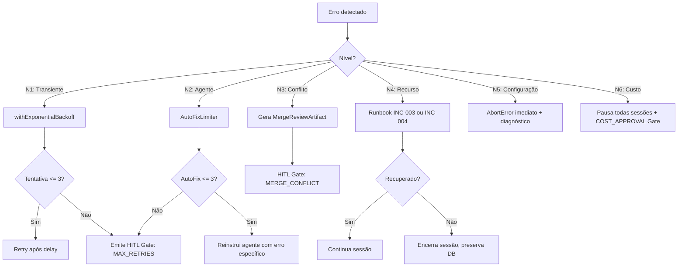
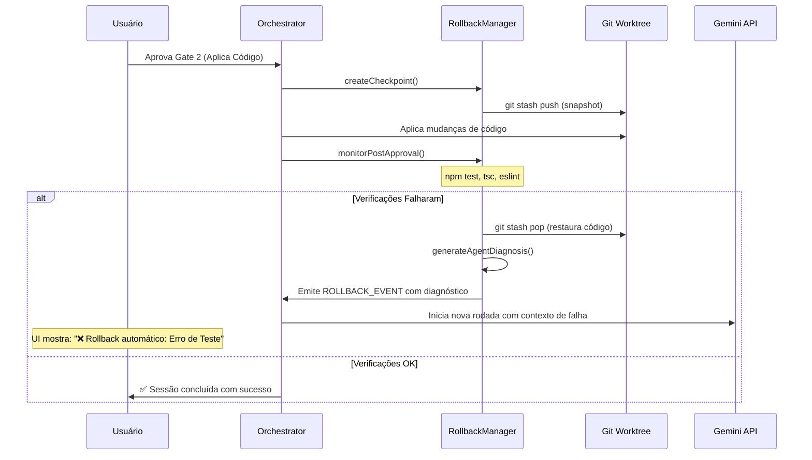

# GreenForge Agent — 04: Playbooks Operacionais

> **Status:** ✅ | **Versão:** 2.2 | **Data:** 2026-05-13

### 📋 Changelog v2.1.1 → v2.2
| Vuln | Correção |
|---|---|
| #15 | GC respeita ROLLBACK_WINDOW_MIN como lock hard — worktree protegido por `ResourceLease` até janela expirar |
| — | INC-009 adicionado: LoopDetector Fallback (tree-sitter indisponível) |

---

## 1. Checklist de Boot

```bash
# Pré-flight obrigatório antes de qualquer sessão
npm run preflight

# O que o preflight verifica (v2.1):
# ✅ Node.js >= 20.11.0
# ✅ git >= 2.30 (suporte a worktrees)
# ✅ GEMINI_API_KEY presente e válida
# ✅ SQLite WAL mode ativo
# ✅ ServerEpoch incrementado (Fencing Token gerado)
# ✅ AGENTS.md integridade (SHA-256 validado)
# ✅ AUTHORIZED_WORKTREES_ROOT configurado e acessível
# ✅ OutboxEvent retenção: limpeza de eventos > 24h
```

### Sequência de Inicialização do RuntimeContainer

```
1. PrismaClient.initialize()     → conecta ao SQLite, verifica WAL mode
2. AgentFactory.initialize()     → parseia AGENTS.md, valida roles core
3. DebateOrchestrator.initialize()→ registra handlers de eventos
4. SSETransport.initialize()     → setup de rotas SSE no Express
5. WebSocketTransport.initialize()→ setup do Socket.IO server
6. GarbageCollector.initialize() → agenda GC periódico (Prioridade de Shutdown: 0, sempre o último a morrer para limpar worktrees sem lock)
```

---

## 1.5 Classificação de Erros e Estratégias de Recuperação

> **Regra NEXUS:** Cada nível de erro deve ter timeout, máx tentativas e ação automática definidos. Comportamento não especificado é comportamento proibido.

| Nível | Tipo | Exemplos Concretos | Ação Automática | Timeout | Máx Tentativas |
|---|---|---|---|---|---|
| **N1** | Transiente de rede | LLM retorna 429, 503; SSE desconecta | Retry com backoff exponencial | 30s por tentativa | 3 |
| **N2** | Falha de agente | LLM retorna resposta inválida (JSON mal formado, campo obrigatório ausente) | Auto-fix: reinstrui agente com o erro específico | 60s | 3 (AutoFixLimiter) |
| **N3** | Conflito de merge | `git merge` retorna `CONFLICT` | Gera `MergeReviewArtifact`; pausa e emite HITL Gate | N/A (aguarda usuário) | 1 |
| **N4** | Falha de recurso local | SQLite locked, worktree corrompido, node-pty não compila | Tenta recuperação direta (ver runbook INC-003, INC-004); se falhar, encerra sessão e preserva estado | 10s | 1 |
| **N5** | Erro de configuração | AGENTS.md inválido, `GEMINI_API_KEY` ausente, papel core faltando | **Falha imediata** (`AbortError`) — não retenta; exibe mensagem de diagnóstico com ação corretiva específica | 0s | 0 |
| **N6** | Limite de custo | `dailyBudgetUsd` atingido, pedido de 1M tokens sem aprovação | Pausa todas as sessões ativas; emite HITL Gate `COST_APPROVAL`; não retenta | N/A | 0 |

**Diagrama de decisão Self-Healing:**



---

## 2. Matriz de Troubleshooting

### 2.1 Problemas de Debate

| Sintoma | Causa Provável | Ação |
|---|---|---|
| Debate travado em "Round 1..." por > 2 min | Timeout de LLM ou rate limit 429 | Ver logs: `GEMINI_API_KEY` válida? Verificar `LLMCallLog` no DB |
| `FORCE_DECISION` sempre após Round 3 | Agentes em loop sobre o mesmo issue | Revisar SOP do Crítico no `AGENTS.md`; reduzir `temperature` do Crítico |
| Árbitro retorna `CONVERGE` com issues HIGH abertos | Bug no `convergence_trigger` | Verificar `debate_config.convergence_trigger` do Judge no `AGENTS.md` |
| Debate encerra em Round 1 sempre | `CONFIDENCE_GATE` muito baixo | Aumentar `CONFIDENCE_GATE` de 0.95 para 0.98 no `.env` |
| `manager_confidence` sempre < 0.85 | Objetivo muito vago ou ManagerAgent mal configurado | Revisar system prompt do ManagerAgent; testar com objetivo mais específico |

### 2.2 Problemas de Comunicação

| Sintoma | Causa Provável | Ação |
|---|---|---|
| SSE desconecta a cada 30s | Proxy sem suporte a keep-alive | Verificar `X-Accel-Buffering: no` no servidor; usar HTTP/2 |
| WebSocket não conecta | Firewall bloqueando upgrade | Verificar porta 5174; testar com `wscat ws://localhost:5174` |
| Tokens não aparecem em tempo real na UI | Buffering de response | Verificar `res.flushHeaders()` no SSE handler; desabilitar gzip no dev |
| Terminal não abre | `node-pty` não compilado | Executar `npm rebuild node-pty`; verificar versão do Node |
| HITL Gate não responde após aprovação | Race condition no `resolveHITL` | Verificar se `orchestrator` foi injetado no `WebSocketTransport.setOrchestrator()` |

### 2.3 Problemas de Worktrees

| Sintoma | Causa Provável | Ação |
|---|---|---|
| `git worktree add` falha | Branch já existe de sessão anterior | Executar `greenforge gc --force` para limpar worktrees órfãos |
| Merge falha com conflitos | Propositor e Crítico editaram o mesmo arquivo | Ver `MergeReviewArtifact` em `.greenforge/conflicts/`; resolver manualmente |
| Worktrees acumulando em disco | GC não rodando | Executar `greenforge gc --dry-run` para diagnóstico; verificar logs do GarbageCollectionLog |
| Rollback falha | `git revert` com conflitos | Executar `git revert --abort`; resolver conflitos manualmente no terminal integrado |

### 2.4 Problemas de Contexto

| Sintoma | Causa Provável | Ação |
|---|---|---|
| Agente "alucina" arquivos que não existem | Contexto insuficiente (repo grande) | Ativar gate de análise global; verificar `CONTEXT_TOKEN_BUDGET` |
| **Loop Detectado (N2/N3)** | Agente repetindo output ou estado estagnado | Verificar `LoopDetector` logs; intervir manualmente se o Judge não resolver |
| **Eventos fora de ordem** | Delay no SSE ou WebSocket | Verificar `seq_id` no console do browser; garantir que o client reorder buffer está ativo |
| **Drift de Contexto** | Compressão agressiva perdeu detalhes técnicos | Verificar `DialecticalAnchor` no log de compressão; se corrompido, reiniciar sessão |

---

## 2.5 Playbook de Rollback Automático (Audit de Estresse)

Se um código aprovado falhar nas verificações automáticas, o sistema executa o protocolo de recuperação:



---

## 3. Playbooks de Incidentes

### INC-001: Debate Interrompido — Reconnect após Queda de Rede

**Sintoma:** Cliente perde conexão SSE durante debate. Ao reconectar, os eventos do round em andamento não estão visíveis na Timeline.

**Diagnóstico (passo a passo):**

```bash
# Passo 1: Verificar se o processo Node.js ainda está ativo
tasklist | grep node  # Windows
# Se processó morreu → executar Passo 3
# Se processo está ativo → SSE reconecta automaticamente (Last-Event-ID)

# Passo 2: Confirmar estado da sessão no DB
sqlite3 .greenforge/db.sqlite \
  "SELECT id, status, task FROM DebateSession ORDER BY startedAt DESC LIMIT 5;"
# status = IN_PROGRESS → debate ainda em andamento no servidor
# status = ABORTED → sessão encerrada; iniciar nova

# Passo 3: Se processo morreu − marcar sessões órfãs como ABORTED
sqlite3 .greenforge/db.sqlite \
  "UPDATE DebateSession SET status='ABORTED' WHERE status='IN_PROGRESS';"

# Passo 4: Verificar integridade do worktree antes de reiniciar
git -C .greenforge/worktrees/<sessionId>-proposer status
# Se worktree corrompido → ver INC-003

# Passo 5: Reiniciar servidor
greenforge serve
```

**Critério de resolução:** `GET /health` retorna `{"AgentFactory": true}` e nova sessão de debate completa Round 1 sem erro.

---

### INC-002: Rate Limit 429 em Pico de Uso

**Sintoma:** Múltiplos agentes em paralelo → Gemini retorna 429.

```bash
# 1. Verificar pattern de erros
sqlite3 .greenforge/db.sqlite \
  "SELECT agentId, errorCode, COUNT(*) as hits FROM LLMCallLog
   WHERE errorCode='429' AND createdAt > datetime('now', '-1 hour')
   GROUP BY agentId ORDER BY hits DESC;"

# 2. Ações imediatas:
# a) Reduzir MAX_DEBATE_ROUNDS=2 temporariamente
# b) Usar gemini-2.5-flash-lite para todos os agentes (maior RPM)
# c) Adicionar delay artificial entre rounds (configurar em AGENTS.md)

# 3. Monitoramento de quota
sqlite3 .greenforge/db.sqlite \
  "SELECT SUM(totalTokens), SUM(costUsd) FROM TokenUsage
   WHERE createdAt > datetime('now', 'start of day');"
```

---

### INC-003: Worktree Corrompido — Merge Bloqueado

**Sintoma:** `git worktree merge` falha com `CONFLICT`.

```bash
# 1. Identificar arquivos em conflito
git -C .greenforge/worktrees/<sessionId>-proposer diff --name-only --diff-filter=U

# 2. Ver o MergeReviewArtifact gerado
cat .greenforge/conflicts/<timestamp>-conflict.md

# 3. Opção A: Resolver via terminal integrado na IDE (recomendado)
# Abrir terminal no worktree, editar conflitos, git add, git commit

# 4. Opção B: Rejeitar o merge e iniciar nova sessão de debate
sqlite3 .greenforge/db.sqlite \
  "UPDATE DebateSession SET status='ABORTED' WHERE id='<sessionId>';"
greenforge gc --force
```

---

### INC-004: SQLite Locked — Múltiplos Processos

**Sintoma:** `SQLITE_BUSY: database is locked`.

```bash
# 1. Verificar WAL mode
sqlite3 .greenforge/db.sqlite "PRAGMA journal_mode;"
# Deve retornar: wal

# 2. Se não estiver em WAL:
sqlite3 .greenforge/db.sqlite "PRAGMA journal_mode=WAL;"

# 3. Verificar processos concorrentes
lsof .greenforge/db.sqlite

# 4. WAL checkpoint manual se arquivo -wal crescer > 100MB
sqlite3 .greenforge/db.sqlite "PRAGMA wal_checkpoint(FULL);"
```

---

### INC-005: AGENTS.md Inválido — AgentFactory Falha no Boot

**Sintoma:** `[AgentFactory] FATAL: papel core ausente: 'judge'`.

```bash
# 1. Validar syntax YAML do AGENTS.md
node -e "const yaml = require('js-yaml'); yaml.load(require('fs').readFileSync('AGENTS.md','utf8'))"

# 2. Verificar campos obrigatórios no agente judge
grep -A 5 "debate_role: judge" AGENTS.md

# 3. Verificar se enabled: true está presente
grep "enabled:" AGENTS.md

# 4. Teste rápido de discovery
node -e "const {AgentFactory} = require('./dist/core/AgentFactory'); new AgentFactory().discover().then(console.log)"
```

---

### INC-006: Rollback Falhou (git revert com conflito)

**Sintoma:** Botão "↩ Desfazer" retorna erro; `git revert HEAD` gera conflito.

```bash
# 1. Verificar estado do revert
git status
git revert --abort  # Cancela o revert em andamento

# 2. Identificar os arquivos em conflito
git diff --name-only --diff-filter=U

# 3. Resolver manualmente via terminal integrado na IDE

# 4. Completar o revert
git add .
git revert --continue

# 5. Atualizar o DB
sqlite3 .greenforge/db.sqlite \
  "UPDATE MergeEvent SET revertedAt=datetime('now') WHERE id='<mergeEventId>';"

---

### INC-007: Epoch Discontinuity (Server Restart)

**Sintoma:** Cliente tenta enviar `HITL_DECISION`, mas recebe erro 409 (Conflict) ou 403 (Forbidden).
**Causa:** O servidor reiniciou e o `epoch_id` do cliente é anterior ao `epochSeq` atual no SQLite.

**Ação:**
1. O cliente detecta o erro e emite alerta: "Servidor reiniciado. Recarregando contexto...".
2. O cliente deve realizar **Gate Hydration**: buscar o estado atual via `GET /api/debate/:sessionId`.
3. Se a sessão ainda estiver ativa, o cliente atualiza seu `epoch_id` local e reenvia a decisão.
4. Se o servidor perdeu o estado volátil (non-Saga), a sessão deve ser reiniciada.

### INC-008: Outbox Buffer Overflow

**Sintoma:** Inserção em `OutboxEvent` lenta ou falhando.
**Causa:** `SSE_EVENT_MAX_AGE_MS` muito alto ou volume massivo de tokens.

**Ação:**
1. Executar limpeza manual: `DELETE FROM OutboxEvent WHERE createdAt < datetime('now', '-1 hour');`.
2. Reduzir verbosidade dos logs SSE no `.env`: `LOG_LEVEL=info`.
3. Executar `VACUUM;` no SQLite para compactar o arquivo.
```

### INC-009: LoopDetector Fallback Ativado (tree-sitter indisponível)

**Sintoma:** Log de boot mostra `[LoopDetector] tree-sitter indisponível. Usando SHA-256 fallback`.

**Causa:** `tree-sitter` não foi compilado no ambiente (comum em Windows nativo sem Build Tools).

```bash
# 1. Verificar status do LoopDetector
curl http://localhost:5174/health
# { "LoopDetector": "fallback:SHA256" } → funcional com Tier 3 (aceitável)
# { "LoopDetector": false }              → falha crítica

# 2. Tentar recompilar
npm rebuild tree-sitter

# 3. Se falhar em Windows: instalar Build Tools
npm install --global --production windows-build-tools
npm rebuild tree-sitter
```

> **Impacto do Fallback SHA-256:** Loops com renomeação de variáveis NÃO são detectados.
> Loops exatos (mesmo código byte-a-byte) são detectados. Considerar WSL2 para produção.

**Critério de resolução:** `GET /health` retorna `{ "LoopDetector": "active:AST+SIMHASH" }`.

---

## 4. Garbage Collection

### 4.1 O Que o GC Remove

```typescript
// Critérios para remoção de recursos
interface GCCandidate {
  worktreePath: string;
  debateSessionId: string;
  ageHours: number;     // Padrão: remove se > 1h
  hasActiveProcess: boolean; // Verifica via PID no ResourceLease
  hasUnmergedCommits: boolean; // Avisa se true; requer --force
  leaseActive: boolean; // O GC DEVE ignorar worktrees com ResourceLease válido no SQLite
  epoch_id: number;     // Recursos de épocas anteriores são candidatos prioritários se o PID não existir
  // v2.2 — vuln #15: worktrees dentro da janela de rollback são IMUNES ao GC
  // O DebateOrchestrator estende o ResourceLease por ROLLBACK_WINDOW_MIN após o merge
  // para garantir que o GC não remova o worktree (e seus logs em .greenforge/conflicts/)
  // antes da janela de rollback expirar.
  rollbackWindowExpiresAt?: Date; // Se preenchido e > Date.now(), GC DEVE ignorar este worktree
}
```

> **Contrato de Imunidade (v2.2 — vuln #15):** Após um merge aprovado, o `DebateOrchestrator`
> DEVE chamar `worktreeHandle.extendLease(ROLLBACK_WINDOW_MIN)` para estender o `ResourceLease`
> pelo período completo da janela de rollback. O GC respeita este lease como um lock irréivel.
> O `MergeReviewArtifact` e os logs em `.greenforge/conflicts/` DEVEM permanecer acessíveis
> durante toda a janela de rollback.

### 4.2 Runbook de GC

```bash
# Diagnóstico (sem remover nada)
greenforge gc --dry-run

# GC padrão (remove órfãos > 1h, com confirmação)
greenforge gc

# GC forçado (CI/CD, sem prompt)
greenforge gc --force

# GC com threshold personalizado
greenforge gc --older-than 24  # Remove apenas recursos > 24h

# Verificar log de GC
sqlite3 .greenforge/db.sqlite \
  "SELECT ranAt, removedWorktrees, removedTasks FROM GarbageCollectionLog ORDER BY ranAt DESC LIMIT 5;"
```

---

## 4.3 Determinismo de Recursos (NEXUS Part 5.2)

| Recurso | Estratégia de Determinismo | Verificação |
|---|---|---|
| **Portas TCP** | Portas para agentes (ex: dev servers) são alocadas via `PortManager` em range estrito (5200-5300) | `netstat -ano | findstr 5200` |
| **Migrações DB** | Toda migração SQLite deve ser `atomic` e idempotente; rollback automático se falha | `prisma migrate deploy` em cada boot |
| **Locks de Arquivo** | Uso de `.lock` files para operações de merge em worktrees concorrentes | Teste: debate simultâneo no mesmo arquivo não corrompe main |

---

### 4.4 Captura de Conhecimento (KIs — NEXUS Part 4.1)

> **Regra NEXUS:** Agentes devem aprender com erros corrigidos. Falha repetida é erro de governança.

### SOP: Transformando Auto-Fix em Conhecimento
Quando uma `AutoFixAttempt` resolve um bug que o debate inicial não previu:

1. **Extração:** Identificar o padrão do erro e a correção aplicada no `AutoFixAttempt`.
2. **Abstração:** Criar uma regra de restrição em linguagem natural.
3. **Injeção:** Adicionar a regra ao campo `constraints` do agente relevante no `AGENTS.md`.

**Exemplo de fluxo:**
- *Ocorrência:* Agente tentou usar `fs.readFileSync` em um ambiente que exige `await fs.readFile`.
- *Auto-fix:* Corrigiu para `await`.
- *Ação NEXUS:* Adicionar ao `technical_proposer` em `AGENTS.md`:
  - `constraints: ["SEMPRE use versões assíncronas do fs (readFile, writeFile)"]`

---

### 5.1 Pré-release

```bash
# 1. Verificar todos os testes
npm run preflight
npm test

# 2. Validar AGENTS.md em estado limpo
node scripts/validate-agents.js

# 3. Executar migração de banco em staging
DATABASE_URL=file:./staging.sqlite npx prisma migrate deploy

# 4. Smoke test com MOCK_LLM=true
MOCK_LLM=true npm run dev
# → Abrir IDE, submeter objetivo, verificar que debate roda com mock
```

### 5.2 Monitoramento Pós-Deploy

```bash
# Checar saúde de todos os componentes
curl http://localhost:5174/health
# Resposta esperada: { "AgentFactory": true, "SSETransport": true, "WebSocketTransport": true, "PrismaClient": true }

# Monitorar uso de tokens (últimas 24h)
sqlite3 .greenforge/db.sqlite \
  "SELECT model, SUM(totalTokens) as tokens, SUM(costUsd) as cost
   FROM TokenUsage WHERE createdAt > datetime('now', '-1 day')
   GROUP BY model;"
```

---

## 6. Onboarding de 7 Dias

| Dia | Foco | Objetivo |
|---|---|---|
| **1** | Setup e boot | `npm run preflight` passa; IDE abre no browser |
| **2** | Primeiro debate | Entender os 3 papéis; ver Round 1 paralelo no feed |
| **3** | Approval Card | Revisar Gate 1 e Gate 2 (DiffLens chunk-by-chunk) |
| **4** | AGENTS.md | Editar um agente; usar hot reload sem reiniciar o servidor |
| **5** | Segurança | Testar rollback; verificar redação de segredos nos logs |
| **6** | Resiliência | Simular 429; testar GC; verificar reconexão SSE |
| **7** | Pipeline completo | Sessão end-to-end: clarificação → debate → Gate 1 → Gate 2 → merge → rollback |
